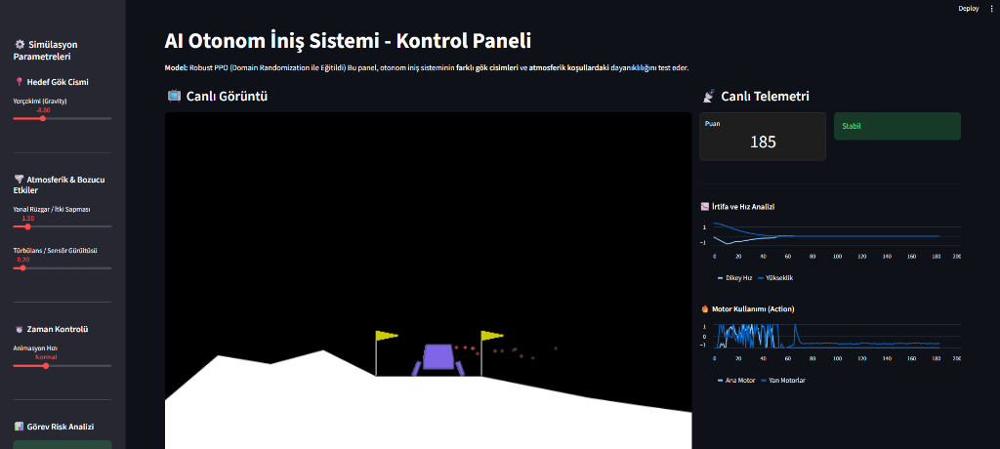

# Robust Lunar Lander RL

Bu proje, 'LunarLanderContinuous-v3' ortamı için Proksimal Politika Optimizasyonu (PPO) kullanan dayanıklı bir Pekiştirmeli Öğrenme (Reinforcement Learning) ajanı uygular. Projenin temel amacı, Alan Rastgeleleştirme (Domain Randomization) yöntemini kullanarak "Simülasyondan Gerçeğe" (Sim-to-Real) geçiş sorununu çözmektir. Ajan, değişken yerçekimi, rüzgar hızları ve türbülans gibi geniş bir fiziksel parametre dağılımı üzerinde eğitilerek, statik bir simülasyona aşırı uyum sağlamak (overfitting) yerine dinamik ve öngörülemeyen koşullara uyum sağlamayı öğrenir.

## Özellikler

*   **Dayanıklı PPO Eğitimi**: Eğitim aşamalarında ortam parametrelerini dinamik olarak değiştirmek için özel bir `DomainRandomizationWrapper` kullanır.
*   **Alan Rastgeleleştirme (Domain Randomization)**:
    *   **Rüzgar**: Sakin havadan kasırga şiddetine kadar değişen rüzgar hızlarını simüle eder.
    *   **Türbülans**: Sensör gürültüsünü veya atmosferik kararsızlığı simüle etmek için rastgele kaotik kuvvetler ekler.
    *   **Yerçekimi**: Farklı gök cisimlerine (örneğin Ay veya Ağır Gezegenler) inişi simüle etmek için yerçekimi kuvvetini değiştirir.
*   **Stres Testi Paketi**: Eğitilmiş ajanı önceden tanımlanmış aşırı senaryolara (örneğin "Ay Fırtınası", "Kasırga") tabi tutan özel bir test modülü (`stress_test.py`).
*   **İnteraktif Kontrol Paneli**: Kullanıcıların ortam parametrelerini etkileşimli olarak ayarlamasına ve ajanın performansını gerçek zamanlı olarak görselleştirmesine olanak tanıyan Streamlit tabanlı bir web uygulaması (`app.py`).
*   **Yörünge Analizi**: İdeal ve kaotik koşullar arasındaki uçuş yollarını karşılaştıran ve grafiğe döken araçlar.

## Proje Yapısı

*   `train_robust.py`: Ana eğitim betiği. Alan rastgeleleştirme ile vektörleştirilmiş ortamı kurar ve PPO modelini eğitir.
*   `stress_test.py`: Eğitilmiş bir modeli yükler ve belirli, kodlanmış senaryolara (Ağır Yerçekimi, Ay Fırtınası, Kasırga) karşı değerlendirir. Testlerin video kayıtlarını kaydeder.
*   `app.py`: Modeli sergilemek için bir Streamlit web uygulaması. Yerçekimi, rüzgar ve türbülansı ayarlamak için bir arayüz sağlar ve gerçek zamanlı telemetri/grafikler görüntüler.
*   `trajectory_analysis.py`: Ajanın ideal koşullardaki uçuş yolu ile rüzgarlı koşullardaki uçuş yolunu karşılaştıran grafikler oluşturur.
*   `models/`: Eğitilmiş modellerin ve kontrol noktalarının (checkpoints) kaydedildiği dizin.
*   `logs/`: TensorBoard günlükleri için dizin.
*   `videos/`: Simülasyon kayıtlarının kaydedildiği dizin.

## Arayüz

Projenin interaktif kontrol paneli (`app.py`), kullanıcıların simülasyon parametrelerini (yerçekimi, rüzgar, vb.) anlık olarak değiştirmesine ve ajanın tepkilerini gözlemlemesine olanak tanır.



## Kurulum

1.  Depoyu klonlayın:
    ```bash
    git clone https://github.com/ozgemellas/robust-lunar-lander-rl.git
    cd robust-lunar-lander-rl
    ```

2.  Sanal bir ortam oluşturun (isteğe bağlı ancak önerilir):
    ```bash
    python -m venv venv
    # Windows
    venv\Scripts\activate
    # macOS/Linux
    source venv/bin/activate
    ```

3.  Gerekli bağımlılıkları yükleyin:
    ```bash
    pip install -r requirements.txt
    ```

## Kullanım

### 1. Ajanın Eğitilmesi

Yeni bir dayanıklı (robust) model eğitmeye başlamak için:

```bash
python train_robust.py
```

Bu betik şunları yapacaktır:
*   `models/PPO_Robust` ve `logs/PPO_Robust` dizinlerini oluşturur.
*   Alan Rastgeleleştirme ile 4 paralel ortam başlatır.
*   PPO ajanını 2.000.000 zaman adımı boyunca eğitir.
*   Her 100.000 adımda bir kontrol noktalarını ve tamamlandığında son modeli kaydeder.

### 2. Stres Testlerinin Çalıştırılması

Eğitilmiş modeli aşırı koşullar altında değerlendirmek için:

```bash
python stress_test.py
```

Bu betik şunları yapacaktır:
*   `ppo_lunar_robust_final.zip` (veya yapılandırılmış belirli model adını) yükler.
*   Ağır Yerçekimi, Ay Fırtınası ve Kasırga senaryoları için testleri çalıştırır.
*   Her senaryo için başarı oranlarını ve ortalama ödülleri yazdırır.
*   Bölümlerin video kayıtlarını `videos/` klasörüne kaydeder.

### 3. Yörünge Analizi

Uçuş yollarını görselleştirmek için:

```bash
python trajectory_analysis.py
```

Bu, ideal koşullardaki bir uçuş ile güçlü yanal rüzgarlar altındaki bir uçuş arasındaki farkı gösteren `trajectory_plot.png` grafiğini oluşturacaktır.

### 4. İnteraktif Simülasyon (Web Uygulaması)

İnteraktif kontrol panelini başlatmak için:

```bash
streamlit run app.py
```

Bu komut, web tarayıcınızda şunları yapabileceğiniz bir sekme açacaktır:
*   Eğitilmiş modeli seçmek.
*   Yerçekimi, Rüzgar ve Türbülans kaydırıcılarını manuel olarak ayarlamak.
*   Gerçek zamanlı ölçümleri (İrtifa, Hız, Motor Kullanımı) görüntülemek.
*   Ajanın sizin belirlediğiniz özel koşullar altında iniş yapmaya çalışmasını izlemek.

## Lisans

Bu proje MIT Lisansı altında lisanslanmıştır. 
